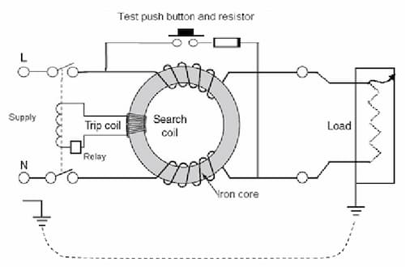

Short for Residual Current Device. Trips when line current and neutral current
are different. Protects against earth faults, leakage currents, and electric
shocks.

### Residual current

The difference between live and neutral currents.

### Mechanism

Consists of a solonoid coil. There are 2 identical windings on the coil.

Under normal operation, the residual current is $0$. Generated magnetic fields
cancel each other out. There will not be any induced emf. $ $

When some current leaks to earth (like when someone touch the live wire), there
will be a residual current. Which causes an unbalanced flux. Trips when the
residual current exceeds the rated sensitivity (usually $30\,\text{mA}$). $ $
