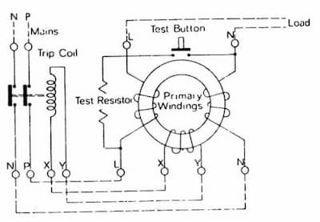

Short for Residual Current Circuit Breaker. A type of
[RCD](/electrical-fundamentals/electrical-installation/rcd).

In both ELCB and RCCB, a test switch is provided to create an artificial fault.

## Advantages of RCCB

- No earthing required  
  ELCB relies on proper earthing; RCCB doesn't.
- More reliable  
  RCCB avoids relying on earthing systems that can deteriorate over time and
  uses solid-state circuits.
- Faster  
  RCCB has fewer mechanical parts and uses a direct sensing mechanism through
  core balance transformer.
- More protection  
  RCCB protects against both earth leakage faults and electric shock hazards,
  while ELCB only protects against earth leakage faults.

## Ratings

- Rated current
- Rated voltage
- Sensitivity

:::note

2 Pole RCCB - used in single-phase supply connection that has only a live and
neutral wire.

:::
