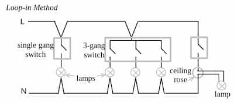
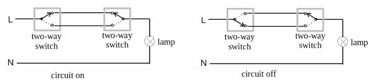
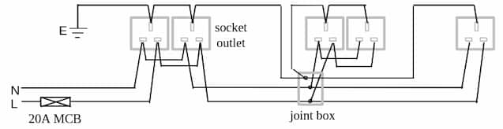
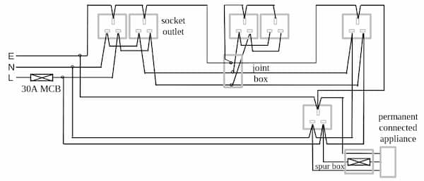

Most domestic installations in Sri Lanka use single phase. For higher loads,
third phase can be installed on request. The electricity is supplied through a
service cable which includes a live wire and a neutral wire and in
$230\,\text{V}$. $ $

The service cable first goes into the energy meter.

### Electric meter

Installed by the electric utility, for billing purposes. Can either be
electromechanical, electronic, or smart meter. Measures energy in $\text{kWh}$.
Up to the electric meter, the equipment belongs to the supply utility.
Consumer's installation starts from the main switch. After the electric meter,
the live and neutral wires are connected to the main switch in the consumer
board. $ $

### Consumer unit

Aka. distribution unit. Size of the consumer unit depends on the size of the
property and how many circuits are being controlled.

- Controls the distribution of power
- Provides protection against faults

### Main circuit breaker

Aka. main switch. Controls the electricity to the rest of the consumer unit and
all the circuits in the property. Can be operated manually to cut the power.
Disconnects both live and neutral wires. Operates automatically if the overall
load demand grows too high. Has a rated voltage and rated current.

After the main switch, the wires are connected to the
[RCCB](/electrical-fundamentals/electrical-installation/rccb). After RCCB:

- the live wire goes to live bus bar
- the neutral wire goes to neutral bus bar
- the earth bus bar will have a wire earthed separately

### Bus bar

A conductive metal thing. Used to reduce the number of wires. There are earth,
live and neutral bus bars.

After the live bus bar, the live wire is connected to multiple
[MCB](/electrical-fundamentals/electrical-installation/mcb)s.

## Wiring a final circuit

### Loop-in method

Enables all joints and terminations in a single final circuit to be made at
ceiling roses, switches or other accessories. This makes all joints accessible
for testing and alterations. Each final circuit has both its live and neutral
conductors terminating at the consumer unit. Wires are usually laid in PVC
conduits.

:::note

Lamp circuits do not normally need an earth wire unless there is a metallic
fitting which needs to be earthed for safety.

:::

### Two-way switches

Used when it's necessary to operate an equipment from 2 positions.

## Socket outlets

There are 3 types of socket outlets.

- $5\,\text{A}$ - Circular holes
- $13\,\text{A}$ - Rectangular holes. Currently recommended one. Safest one
  compared to other. Better because of flat-to-flat contact.
- $15\,\text{A}$ - Bigger circular holes

## Final circuits for socket outlets

Electrical equipments can be wired in 2 ways.

### Radial circuit

Each circuit commences from consumer unit through an MCB (or fuse), loops into
each socket outlet and terminates at the last socket outlet.

To connect 2 equipments in radial connection:

- 2 switches are required. Both switches are connected to a MCB. Each connect to
  the equipments
- 2 live wire connects 2 switches to of them to a MCB
- Neutral wires of the 2 equipments is connected to the neutral bus bar.

:::note

Clip-on meter can be used to measure the current drawn by an electrical
equipment.

:::

### Ring circuit

Each circuit commences from consumer unit through an MCB (or fuse), loops into
each socket outlet and returns to the same MCB (or fuse) in the consumer unit.

Looping must be done for the live, neutral and the protective conductors in
separate rings. Electricity can flow from either ends. This increases the
current carrying capacity without increasing the wiring size.

A ring circuit can only be used when:

- The floor area served by the ring does not exceed $100\,\text{m}^2$
- Maximum demand of the circuit doesn't exceed the MCB (or fuse) rating

To connect 2 equipments in ring connection:

- A live wire starts from a MCB, connects to the 2 equipments and come back to
  the MCB
- Similarily neutral wire is connected in a ring starting from neutral bus bar
