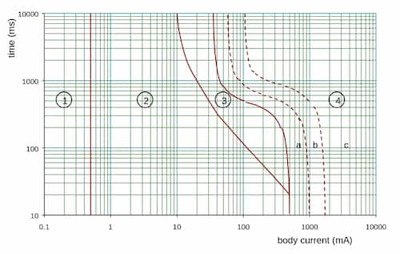

Occurs when current flows through the human body.

### Ventricular fibrillation

Prevention of the heart to act as an effective pump. Stops blood circulation to
all parts of body. Causes death in a very short time.

## Degree of danger

Depends on

- Value of the body current
- Time for which the current flows

## Zones

The below chart shows the time/current zones of effects of $50\,\text{Hz}$
current on the human body: $ $

| Zone   | Description                                                                                                          |
| ------ | -------------------------------------------------------------------------------------------------------------------- |
| Zone 1 | No sensation                                                                                                         |
| Zone 2 | Perceptable. Not harmful. 10mA is the threshold of let-go                                                            |
| Zone 3 | Mascular contractions and difficulty in breathing. Usually no danger of ventricular fibrillation. (0.5% possibility) |
| Zone 4 | Probability of ventricular fibrillation increases. (a - up to 5%, b - up to 50%, c - more than 50%)                  |

:::note

From the above chart, 30mA never goes into zone 4. Thus typically used in
residual current devices for the safety of people.

:::
