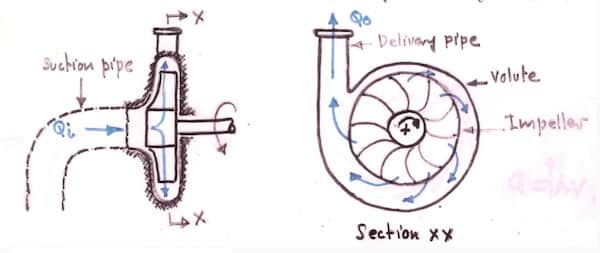
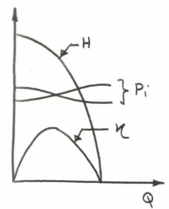

Most used pumps in engineering because they support wide range of heights and
flow rates. Radial flow, rotodynamic pump.

### Volute

Casing of the impeller. A passage with increasing area, to reduce velocity (to
reduce losses).

### Diffuser

A fixed set of vanes installed inside the volute.

Optional. Increases pressure of the fluid exiting the impeller by decreasing its
velocity. Guides the fluid tangentially into the volute. Minimizes energy loss
from turbulence and impact.

## Operation

- Volute must be filled with fluid to start pumping  
  This process is called _priming_.
- Fluid enters through the _eye_ of the impeller
- $v$ and $P$ are increased when the fluid flows through the impeller

## Performance characteristic

