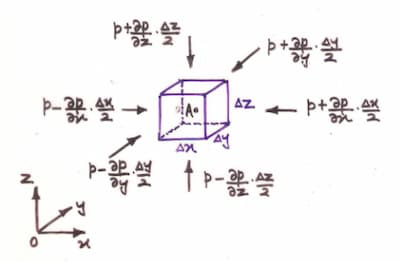

At a point,

```math
P = \lim_{\delta A \to 0} \frac{\delta F}{\delta A}
```

## Pascal's law

The hydrostatic pressure at a point is the same from all directions.

### Proof

Consider the fluid element shown, containing the point $A$. $ $

<svg version="1.1" xmlns="http://www.w3.org/2000/svg" viewBox="0 0 512.5999908447267 438.9999999999999" height="350" class="mx-auto">
  <g stroke-linecap="round"><g transform="translate(122.59737417943109 103.9584245076586) rotate(0 -1.1368683772161603e-13 108.22210065645515)"><path d="M0 0 C0.63 48.4, 1.41 100.77, 0 216.44 M0 0 C-0.56 72.69, -0.88 144.93, 0 216.44" stroke="#1e1e1e" stroke-width="2" fill="none"></path></g></g><mask></mask><g stroke-linecap="round"><g transform="translate(439.676148796499 320.4026258205689) rotate(0 -158.53938730853406 0)"><path d="M0 0 C-71.03 1.71, -138.79 1.64, -317.08 0 M0 0 C-99.02 -0.53, -198.01 -0.5, -317.08 0" stroke="#1e1e1e" stroke-width="2" fill="none"></path></g></g><mask></mask><g stroke-linecap="round"><g transform="translate(439.676148796499 321.9999999999999) rotate(0 -158.53938730853406 -109.02078774617064)"><path d="M0 0 C-97.78 -65.21, -194.84 -131.64, -317.08 -218.04 M0 0 C-72.55 -51.08, -147.5 -101.53, -317.08 -218.04" stroke="#1e1e1e" stroke-width="2" fill="none"></path></g></g><mask></mask><g stroke-linecap="round"><g transform="translate(168.12253829321662 42.45951859956244) rotate(0 -1.1368683772161603e-13 108.2221006564551)"><path d="M0 0 C-0.7 70.13, 0.02 138.7, 0 216.44 M0 0 C1.08 66.46, 2.13 130.96, 0 216.44" stroke="#1e1e1e" stroke-width="2" fill="none"></path></g></g><mask></mask><g stroke-linecap="round"><g transform="translate(485.2013129102846 258.90371991247264) rotate(0 -158.53938730853406 0)"><path d="M0 0 C-70.5 0.81, -141.88 1.93, -317.08 0 M0 0 C-87.94 1.18, -176.5 1.38, -317.08 0" stroke="#1e1e1e" stroke-width="2" fill="none"></path></g></g><mask></mask><g stroke-linecap="round"><g transform="translate(485.2013129102846 260.5010940919036) rotate(0 -158.53938730853406 -109.02078774617064)"><path d="M0 0 C-108.43 -73.58, -216.78 -149.13, -317.08 -218.04 M0 0 C-119.76 -83.58, -239.46 -164.93, -317.08 -218.04" stroke="#1e1e1e" stroke-width="2" fill="none"></path></g></g><mask></mask><g stroke-linecap="round"><g transform="translate(440.47483588621446 319.6039387308532) rotate(0 22.762582056892825 -29.950765864332652)"><path d="M0 0 C18.18 -24.54, 36.63 -49.12, 45.53 -59.9 M0 0 C14 -17.32, 28.93 -37.34, 45.53 -59.9" stroke="#1e1e1e" stroke-width="2" fill="none"></path></g></g><mask></mask><g stroke-linecap="round"><g transform="translate(121 319.6039387308532) rotate(0 23.161925601750568 -30.749452954048138)"><path d="M0 0 C18.1 -20.53, 35.48 -46.6, 46.32 -61.5 M0 0 C19.16 -23.78, 37.76 -48.78, 46.32 -61.5" stroke="#1e1e1e" stroke-width="2" fill="none"></path></g></g><mask></mask><g stroke-linecap="round"><g transform="translate(121.79868708971549 103.15973741794312) rotate(0 23.161925601750568 -30.749452954048138)"><path d="M0 0 C9.98 -13.05, 22.8 -30.28, 46.32 -61.5 M0 0 C11.22 -14.33, 20.66 -27.74, 46.32 -61.5" stroke="#1e1e1e" stroke-width="2" fill="none"></path></g></g><mask></mask><g stroke-linecap="round"><g transform="translate(22 201) rotate(0 33.5 0)"><path d="M0.23 -1.02 C11.46 -0.98, 55.98 -0.97, 66.95 -0.83 M-1.11 1.06 C9.99 1.32, 54.39 0.27, 65.98 0.27" stroke="#1e1e1e" stroke-width="2" fill="none"></path></g><g transform="translate(22 201) rotate(0 33.5 0)"><path d="M42.59 9.12 C47.18 6.64, 53.7 2.78, 65.98 0.27 M42.59 9.12 C48.36 5.82, 56.56 4.47, 65.98 0.27" stroke="#1e1e1e" stroke-width="2" fill="none"></path></g><g transform="translate(22 201) rotate(0 33.5 0)"><path d="M42.38 -7.98 C46.87 -5.92, 53.45 -5.24, 65.98 0.27 M42.38 -7.98 C48.35 -6.39, 56.61 -2.86, 65.98 0.27" stroke="#1e1e1e" stroke-width="2" fill="none"></path></g></g><mask></mask><g stroke-linecap="round"><g transform="translate(246.0000000000001 397.9999999999999) rotate(0 0 -27.5)"><path d="M0.9 -0.08 C0.65 -9.09, -1 -46, -1.16 -55.25 M-0.08 -1.16 C-0.01 -9.89, 1.08 -44.95, 0.95 -53.85" stroke="#1e1e1e" stroke-width="2" fill="none"></path></g><g transform="translate(246.0000000000001 397.9999999999999) rotate(0 0 -27.5)"><path d="M9.24 -30.26 C6.63 -39.84, 3.62 -45.73, 0.95 -53.85 M9.24 -30.26 C7.55 -35.3, 4.59 -41.39, 0.95 -53.85" stroke="#1e1e1e" stroke-width="2" fill="none"></path></g><g transform="translate(246.0000000000001 397.9999999999999) rotate(0 0 -27.5)"><path d="M-7.86 -30.45 C-4.88 -40.1, -2.29 -45.93, 0.95 -53.85 M-7.86 -30.45 C-5.22 -35.36, -3.86 -41.4, 0.95 -53.85" stroke="#1e1e1e" stroke-width="2" fill="none"></path></g></g><mask></mask><g stroke-linecap="round"><g transform="translate(364.0000000000001 59) rotate(0 -18 28.5)"><path d="M0 0.59 C-6.19 9.96, -30.86 46.45, -36.99 55.87 M-1.45 -0.15 C-7.29 9.36, -29.33 47.04, -34.8 56.81" stroke="#1e1e1e" stroke-width="2" fill="none"></path></g><g transform="translate(364.0000000000001 59) rotate(0 -18 28.5)"><path d="M-30.51 32.18 C-30.95 38.24, -35.16 46.31, -34.8 56.81 M-30.51 32.18 C-32.45 40.53, -33.37 47.72, -34.8 56.81" stroke="#1e1e1e" stroke-width="2" fill="none"></path></g><g transform="translate(364.0000000000001 59) rotate(0 -18 28.5)"><path d="M-15.68 40.7 C-20.74 44.09, -29.58 49.5, -34.8 56.81 M-15.68 40.7 C-22.28 46.45, -27.79 51, -34.8 56.81" stroke="#1e1e1e" stroke-width="2" fill="none"></path></g></g><mask></mask><g transform="translate(362.0000000000001 10) rotate(0 12.564002990722656 22.5)"><text x="0" y="31.716" font-family="Excalifont, Xiaolai, Segoe UI Emoji" font-size="36px" fill="#1e1e1e" text-anchor="start" style="white-space: pre;" direction="ltr" dominant-baseline="alphabetic">P</text></g><g transform="translate(469.0000000000001 275.9999999999999) rotate(0 11.5751953125 22.5)"><text x="0" y="31.716" font-family="Excalifont, Xiaolai, Segoe UI Emoji" font-size="36px" fill="#1e1e1e" text-anchor="start" style="white-space: pre;" direction="ltr" dominant-baseline="alphabetic">Δ</text></g><g transform="translate(377.0000000000001 125) rotate(0 11.5751953125 22.5)"><text x="0" y="31.716" font-family="Excalifont, Xiaolai, Segoe UI Emoji" font-size="36px" fill="#1e1e1e" text-anchor="start" style="white-space: pre;" direction="ltr" dominant-baseline="alphabetic">Δ</text></g><g transform="translate(229 272.9999999999999) rotate(0 11.5751953125 22.5)"><text x="0" y="31.716" font-family="Excalifont, Xiaolai, Segoe UI Emoji" font-size="36px" fill="#1e1e1e" text-anchor="start" style="white-space: pre;" direction="ltr" dominant-baseline="alphabetic">Δ</text></g><g transform="translate(79 219) rotate(0 11.5751953125 22.499999999999943)"><text x="0" y="31.716" font-family="Excalifont, Xiaolai, Segoe UI Emoji" font-size="36px" fill="#1e1e1e" text-anchor="start" style="white-space: pre;" direction="ltr" dominant-baseline="alphabetic">Δ</text></g><g transform="translate(257.0000000000001 383.9999999999999) rotate(0 12.564002990722656 22.5)"><text x="0" y="31.716" font-family="Excalifont, Xiaolai, Segoe UI Emoji" font-size="36px" fill="#1e1e1e" text-anchor="start" style="white-space: pre;" direction="ltr" dominant-baseline="alphabetic">P</text></g><g transform="translate(10 204) rotate(0 12.564002990722656 22.499999999999943)"><text x="0" y="31.716" font-family="Excalifont, Xiaolai, Segoe UI Emoji" font-size="36px" fill="#1e1e1e" text-anchor="start" style="white-space: pre;" direction="ltr" dominant-baseline="alphabetic">P</text></g><g transform="translate(21 225) rotate(0 5.909996032714844 12.499999999999943)"><text x="0" y="17.619999999999997" font-family="Excalifont, Xiaolai, Segoe UI Emoji" font-size="20px" fill="#1e1e1e" text-anchor="start" style="white-space: pre;" direction="ltr" dominant-baseline="alphabetic">x</text></g><g transform="translate(267.0000000000001 403.9999999999999) rotate(0 5.719993591308594 12.5)"><text x="0" y="17.619999999999997" font-family="Excalifont, Xiaolai, Segoe UI Emoji" font-size="20px" fill="#1e1e1e" text-anchor="start" style="white-space: pre;" direction="ltr" dominant-baseline="alphabetic">z</text></g><g transform="translate(371.0000000000001 34) rotate(0 5.42999267578125 12.5)"><text x="0" y="17.619999999999997" font-family="Excalifont, Xiaolai, Segoe UI Emoji" font-size="20px" fill="#1e1e1e" text-anchor="start" style="white-space: pre;" direction="ltr" dominant-baseline="alphabetic">s</text></g><g transform="translate(492.0000000000001 291.9999999999999) rotate(0 5.299995422363281 12.5)"><text x="0" y="17.619999999999997" font-family="Excalifont, Xiaolai, Segoe UI Emoji" font-size="20px" fill="#1e1e1e" text-anchor="start" style="white-space: pre;" direction="ltr" dominant-baseline="alphabetic">y</text></g><g transform="translate(400.0000000000001 142) rotate(0 5.42999267578125 12.5)"><text x="0" y="17.619999999999997" font-family="Excalifont, Xiaolai, Segoe UI Emoji" font-size="20px" fill="#1e1e1e" text-anchor="start" style="white-space: pre;" direction="ltr" dominant-baseline="alphabetic">s</text></g><g transform="translate(252 286.9999999999999) rotate(0 5.909996032714844 12.5)"><text x="0" y="17.619999999999997" font-family="Excalifont, Xiaolai, Segoe UI Emoji" font-size="20px" fill="#1e1e1e" text-anchor="start" style="white-space: pre;" direction="ltr" dominant-baseline="alphabetic">x</text></g><g transform="translate(103 235) rotate(0 5.719993591308594 12.499999999999943)"><text x="0" y="17.619999999999997" font-family="Excalifont, Xiaolai, Segoe UI Emoji" font-size="20px" fill="#1e1e1e" text-anchor="start" style="white-space: pre;" direction="ltr" dominant-baseline="alphabetic">z</text></g></svg>

From the image:
$\sin{\theta}=\frac{\Delta{z}}{\Delta{s}}\;\land\;\cos{\theta}=\frac{\Delta{x}}{\Delta{s}}$
$ $

For equilibrium:

```math
P_x(\Delta{y}\Delta{z})-P_s(\Delta{y}\Delta{s})\sin{\theta}=0
\implies
P_x=P_s
```

```math
P_z(\Delta{x}\Delta{y})-P_s(\Delta{y}\Delta{s})\cos{\theta}-\frac{1}{2}\Delta{x}\Delta{y}\Delta{z}\rho g=0
\implies
P_z=P_s+\frac{1}{2}\Delta{z}\rho g
```

As all $\Delta{x},\Delta{y},\Delta{z}$ approaches $0$: $P_z=P_s$. Therefore
$P_x=P_z=P_s$

## Variation along directions

### Proof

Let $p$ be the pressure at the point $A\equiv (x,y,z)$.

```math
p = f(x,y,z)
```

```math
dp =
\frac{\partial p}{\partial x} \text{d}x
+
\frac{\partial p}{\partial y} \text{d}y
+
\frac{\partial p}{\partial z} \text{d}z
```

By considering equilibrium of this fluid element containing $A$. $ $



In the $x$ direction,$ $

```math
\bigg(
	p -
	\frac{\partial p}{\partial x} \frac{\Delta{x}}{2}
\bigg)
\Delta{y}
\Delta{z}
-
\bigg(
	p +
	\frac{\partial p}{\partial x} \frac{\Delta{x}}{2}
\bigg)
\Delta{y}
\Delta{z}

= 0
```

```math
\frac{\partial p}{\partial x} = 0
```

Similarly $ \frac{\partial p}{\partial y} = 0 $ can be proven. $ $

In the $z$ direction,$ $

```math
\bigg(
	p -
	\frac{\partial p}{\partial z} \frac{\Delta{z}}{2}
\bigg)
\Delta{x}
\Delta{y}
-
\bigg(
	p +
	\frac{\partial p}{\partial z} \frac{\Delta{z}}{2}
\bigg)
\Delta{x}
\Delta{y}

-
\Delta{x}
\Delta{y}
\Delta{z}
\rho
g

= 0
```

```math
\frac{\partial p}{\partial z} = -\rho g
```

```math
dp = -\rho g\,\text{d}z
```

```math
p = -\int{\rho g\,\text{d}z}
```

:::note[For incompressible fluids]

$\rho$ is constant. $ $

```math
p = -\rho g\int{\text{d}z} = -\rho gz + c = f(z)
```

:::

## Isobar

Surface of constant pressure.

## Types of pressure

### Atmospheric Pressure

Pressure exerted by atmospheric air.

### Gauge Pressure

Measured in respect to atmospheric pressure.

### Absolute Pressure

Measured in respect to perfect vaccum.

```math
\text{Absolute Pressure} = \text{Atmospheric Pressure} + \text{Guage Pressure}
```

### Piezometric pressure

```math
P = -\rho gz + c
```

```math
P + \rho gz = c = P^{*}
```

## Pressure diagram

A diagram showing the variation of pressure along a submerged surface.

## Pressure Head

Height of a particular fluid column that will produce the pressure at a point.

```math
\text{Pressure head} = h = \frac{p}{\gamma}
```

## Pressure difference between 2 points

Suppose there are 2 points $\text{A},\text{B}$ with a height difference of $h$.

$ P_1 = -\rho gz_1 + c $

$ P_2 = -\rho gz_2 + c $

$ P_2 - P_1 = -\rho g(z_2 - z_1) = -\rho g (-h) = h \rho g $

$ P_2 = P_1 + h \rho g $
