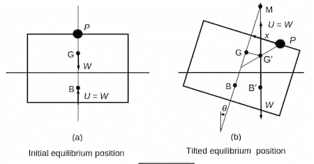
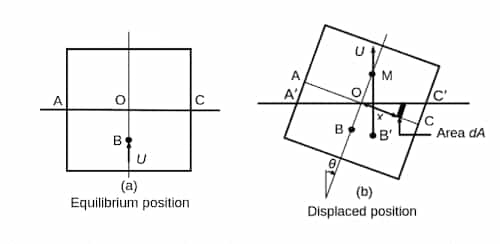
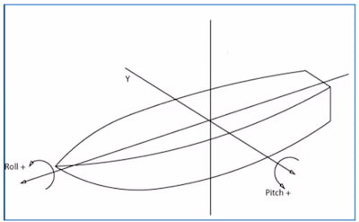

## Fully submerged bodies

| Equilibrium type | Description      |
| ---------------- | ---------------- |
| Stable           | $B$ is above $G$ |
| Unstable         | $B$ is below $G$ |
| Neutral          | ${B}\equiv{G}$   |

## Floating bodies

Suppose a body of weight $W$ acting through the centre of gravity $G$ is
floating in a fluid is at equilibrium. The buoyancy $U$ acts through the centre
of buoyancy $B$.

### Metacentre

Intersection point between the line of action of $U$ through $B$ **and** the
axis $BG$. Denoted by $M$.

For small displacements $M$ is fixed in position relative to the body.$ $

### Stability conditions

| Equilibrium type | Description      | Condition |
| ---------------- | ---------------- | --------- |
| Stable           | $M$ is above $G$ | $GM>0$    |
| Unstable         | $M$ is below $G$ | $GM<0$    |
| Neutral          | $M\equiv{G}$     | $GM=0$    |

### Metacentric height

The distance $\text{GM}$. Measured upwards from $G$.

### Metacentric radius

The distance $\text{BM}$. Measured upwards from $B$.

:::note

Metacentric height and metacentric radius are related by: $BM=BG+GM$.$ $

:::

## Calculating metacentric height

### Experimental value

The metacentric height of a floating body can be determined experimentally by
shifting a known weight by a known distance and measuring the angle of tilt.



In the above picture

- $P$ - a small mass
- $G$ - initial centre of mass
- $B$ - initial centre of buoyancy
- $W$ - total weight of floating body
- $U$ - upthrust exerted on floating body
- $G'$ - new centre of mass
- $B'$ - new centre of buoyancy
- $x$ - small displacement applied to $P$

Considering the shift in centre of gravity:

```math
W(GG')=Px+0(W-P) \implies GG'=\frac{Px}{W}
```

When $\theta$ is very small: $ $

```math
GG'=\frac{Px}{W}\approx(GM)\theta\implies GM\approx\frac{Px}{W\theta}
```

```math
GM=\lim\limits_{\theta\to{0}}\frac{Px}{W\theta}
```

### Theoretical value

If the shape of the submerged volume is known, the metacentric height can
theoretically be determined.



#### Rotation is about centroidal axis of waterline plane

As the submerged volume remains unchanged during angular displacement, it can be
derived that the rotation occurs about the centroidal axis of the waterline
plane.

```math
\int_{O}^{C}{x\tan{\theta}\,\text{d}A}
=
\int_{O}^{A}{x\tan{\theta}\,\text{d}A}
\implies
\int_{O}^{C}{x\,\text{d}A}=0=A\overline{x}
```

Here,

- $A$ - area of waterline plane
- $\overline{x}$ - distance to the centroid from axis $OO$

#### Equation for metacentric radius

Considering the shift in centre of buoyancy:

```math
U(BB')=
\int_{O}^{C}{x\theta\rho{g}\cdot{x}\,\text{d}A}
-
\int_{O}^{A}{x\theta\rho{g}\cdot{x}\,\text{d}A}
```

```math
V\rho{g}(BB')=
\theta\rho{g}
\Bigg(
\int_{O}^{C}{x^2\,\text{d}A}
-
\int_{O}^{A}{x^2\,\text{d}A}
\Bigg)
```

```math
V(BB')=
\theta
\bigg(
\int_{A}^{C}{x^2\,\text{d}A}
\bigg)
=I\theta
```

Here

- $V$ - submerged volume
- $I$ - second moment of area of the waterline plane about the centroidal axis
  $OO$

```math
BB'=\frac{I\theta}{V}\approx (BM)\theta\implies BM=\frac{I}{V}
```

This result is restricted to small angular displacements — usually up to about
$8°$— and the restriction is particularly important when the sides of the
floating body are not vertical. $ $

$OG$ and $OB$ can be calculated easily for a body with known shape. Then the
metacentric height can be found.

```math
GM = BM - OG + OB
```

## Types of tilting



- Pitching - tilting about transverse axis
- Rolling - tilting about longitudinal axis

## Time period of oscillation

Below equation can be derived by using $\tau=I\ddot{\theta}$ (for small
$\theta$):

```math
\tau=-W(\text{GM})\sin{\theta}=I_G\ddot{\theta}
```

```math
\ddot{\theta}=-\frac{W(\text{GM})}{I_G}\theta=-\frac{Mg(\text{GM})}{Mk^2}\theta
```

Here

- $\tau$ - restoring torque
- $W$ - Total weight
- $I_G$ - Moment of inertia of the body about axis of rotation
- $M$ - Total mass
- $k$ - Radius of gyration about axis of rotation

Period of time of oscillation is given by:

```math
T=\frac{2\pi{k}}{\sqrt{g(\text{GM})}}
```

## Liquid cargo in a vessel

- Liquid cargo in a vessel reduces its metacentric height.
- When the cargo is contained in 1 compartment:  
  $\Delta\text{GM}_1=\frac{\rho_1 I_1}{\rho v}$
- When the liquid cargo is contained in $n$ compartments:  
  $\Delta\text{GM}=\frac{1}{n^2}{(\Delta\text{GM}_1)}$
