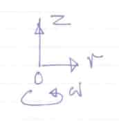

Another type of relative equilibrium. If a fluid-contained vessel is rotating at
a constant angular velocity, the fluid will reach a relative equilibrium
position and rotate with the vessel. Under this condition, the fluid is said to
be in Forced Vortex Motion.

:::note

For s1, forced vortex motion only about vertical axis is required.

:::



```math
P = \frac{1}{2}\rho \omega^2 r^2 - \rho gz +c
```

Here:

- $\omega$ - angular velocity

## Equation of the free surface

On the free surface $P=0$. $ $

```math
z = \frac{\omega^2}{2g}r^2  +c_0
```

The free surface is **parabolic**. The constant part $c_0$ can be found by a
known point of the free surface. For ease of calculations, the axes can be
chosen so that the free surface passes through $(0,0)$. In that case, $c_0 = 0$.

## Vertical Pressure Distribution

Pressure increases linearly with height. Increases exponentially with radial
distance. Isobars are parabolic.

## Volume of the fluid


Total volume of the fluid is:

```math
V=
\pi R^2 h_0
+\frac{1}{2}\pi R^2(H-h_0)
=
\pi R^2 h
```

```math
\implies
V=
\frac{1}{2}\pi R^2 (H + h_0)
=
\pi R^2 h
```

```math
\implies
H + h_0 = 2h
```
