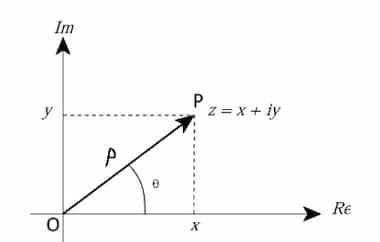

### Representation methods



The methods are:

- Cartesian representation: $z=x+iy$
- Polar representation: $z=pe^{i\theta}$

Here:

- $x = p\cos{\theta}$ - real part
- $y=p\sin{\theta}$ - imaginary part
- $p=\sqrt{x^{2} + y^{2}}$ - modulus
- $\theta=\tan^{-1}{(\frac{y}{x})}$ - arg angle

## Euler's Formula

For $x\in\mathbb{R}$: $ $

```math
e^{ix} = \cos{x} + i\sin{x}
```

:::note[Proof Hint]

Use [Taylor series](/mathematics/real-analysis/taylor-series/#examples) for
$e^x,\cos{x}, \sin{x}$. $ $

:::

## Euler's Identity

One of the most beautiful equations in mathematics.

```math
e^{i\pi} + 1 = 0
```
