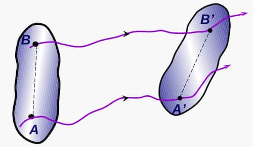
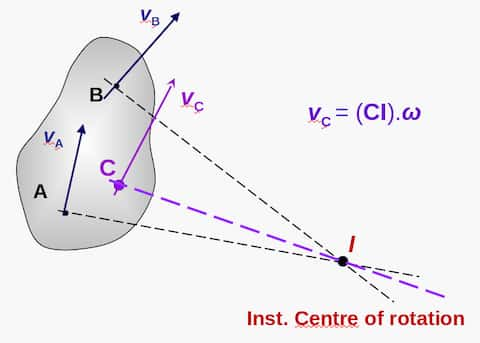

### Rigid body

A solid body that doesn't deform.

### Degrees of freedom

In the motion of a rigid body in 2D kinematics, there are $3$ degrees of
freedom. $ $

- Movement along $x$ direction
- Movement along $y$ direction
- Rotation about $z$ direction

In 3D, there are $6$ degrees of freedom: movement and rotation along each
direction. $ $

### Translation

Movement that changes the position of an object. Translation can be done through
a rectilinear or curvilinear path. Axes of the body always stays parallel.

### Rotation

Circular movement of an object about a fixed axis that is perpendicular to the
plane.

## General 2D motion



Mixture of translation and rotation.

```math
v_\text{B}=
v_\text{A}+v_{\text{B}/\text{A}}=
v_\text{A}+\underline{\dot{\theta}}\times r_{\text{B}/\text{A}}
```

```math
a_\text{B}=
a_\text{A}+a_{\text{B}/\text{A}}=
a_\text{A}+\underline{\ddot{\theta}}\times r_{\text{B}/\text{A}}+\underline{\dot{\theta}}\times (\underline{\dot{\theta}}\times r_{\text{B}/\text{A}})
```

Here:

- $\underline{\dot{\theta}}$ - Angular velocity of $\text{B}$ relative to
  $\text{A}$
- $v_{\text{B}/\text{A}}$ - Velocity of $\text{B}$ relative to $\text{A}$
- $a_{\text{B}/\text{A}}$ - Acceleration of $\text{B}$ relative to $\text{A}$
- $r_{\text{B}/\text{A}}$ - Position vector of $\text{B}$ relative to
  $\text{A}$. It's constant.

In general motion, each particle of the body has a different velocity at every
instance.

### Instantaneous centre of rotation

The point that has $0$ velocity at a particular instant of time. This point
might be changing throughout the motion. Denoted by $I$.

It can be imagined that the object is momentarily having a pure rotation about
this centre $I$. $ $



$I$ can be found by drawing a line perpendicular at the velocity vectors at 2
different points and finding their intersection point. $ $

### Centrode

The locus of instantaneous centres during the motion.
