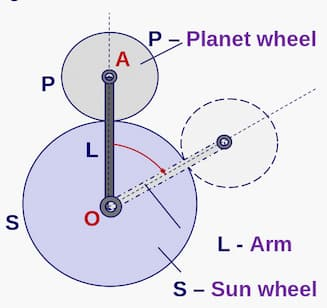
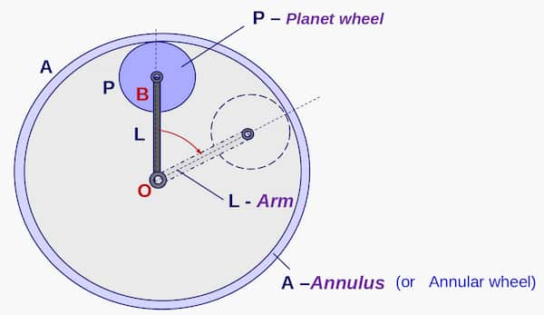

When 2 gears touch:

```math
r_1 \omega_1 = r_2 \omega_2
```

### Pitch

Aka. module of the gear wheel. Denoted by $m$. $ $

```math
d = mz = 2r
```

Here:

- $d$ - pitch circle diameter
- $m$ - pitch of the gear
- $z$ - no. of teeth in the gear
- $r$ - radius of the gear

## Epicyclic gears

In below equations:

- $\omega_p$ - Absolute angular speed of planet wheel $P$

### External



```math
\omega_p=\Big(1+\frac{r_S}{r_P}\Big)\omega_L - \Big(\frac{r_S}{r_P}\Big)\omega_S
```

### Internal



```math
\omega_p=\Big(1-\frac{r_A}{r_P}\Big)\omega_L + \Big(\frac{r_A}{r_P}\Big)\omega_A
```
