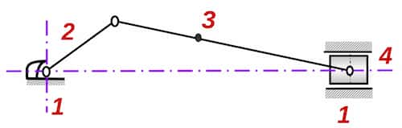

The inversions are obtained by making different kinematic element stationary
(one at a time) while keeping the same set of kinematic pairs.

For example, in slider crank mechanism:

- When link 2 is fixed: Whitworth quick-return mechanism
- When link 3 is fixed: The oscillating cylinder engine
- When link 4 is fixed: Hand pump
