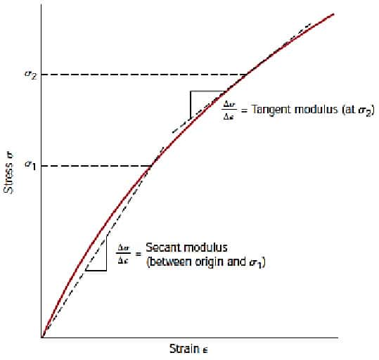

Deformation is temporary. Returns to its original shape when load is released.

### Plasticity

Opposite to elasticity. Deformation is permanent.

## Linear elastic materials

When elastic deformation portion in stress-strain diagram is a straight line.

### Young's modulus

Aka. alastic modulus. Can be thought of as **stiffness**.

```math
\text{Young's modulus }E=\frac{\text{stress}}{\text{strain}}=\frac{\sigma}{\epsilon}
```

## Nonlinear elastic materials

When elastic deformation portion in stress-strain diagram is not a straight
line.

### Secant modulus

Equal to the tangent of the line connecting a point in the stress-strain diagram
and the origin.

### Tangent modulus

Equal to the instantaneous tangent on a point in the stress-strain diagram.


