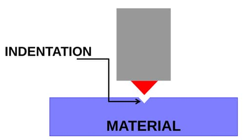

Metal is subjected to indentation with a hard indenter. Depth of the indent is a
measure of hardness.



Hardness units differ with the type of indenter used and the load applied.

## Units

### Brinell (HB)

- $10\,\text{mm}$ diameter steel / WC ball indenter
- Any load can be applied
- Diameter of the indentation is measured instead of the depth

```math
\text{HB} = \frac{2F}{\pi D h}
```

Here:

- $F$ - applied load (in $\text{kN}$)
- $D$ - diameter of the indenter (in $\text{mm}$)
- $d$ - diameter of the indentation (in $\text{mm}$)
- $h = (D-\sqrt{D^2 - d^2})$ - depth of the indentation (in $\text{mm}$)

### Vickers (HV)

- Pyramid shaped indenter made of diamond
- Any load can be applied
- Diagonal lengths $d_1$ and $d_2$ of the diamond-shape indentation are measured
- Average $d$ is used in the calculation

:::note

Angle between the diamond faces is $136$ degrees. $ $

:::

```math
HV= \frac{1.854\,F}{d^2}
```

### Rockwell (HR)

Not accurate enough to be used in academic level (or where accuracy is
important). Industrially preferred because of ease of measurement. Only 3 load
options.

| Type | Load  | Indenter                                          |
| ---- | ----- | ------------------------------------------------- |
| HRA  | 60kg  | Cone-shaped indenter. Made of diamond.            |
| HRD  | 100kg | Cone-shaped indenter. Made of diamond.            |
| HRC  | 150kg | Cone-shaped indenter. Made of diamond.            |
| HRF  | 60kg  | 1/16” diameter (1.5mm approx.) ball made of steel |
| HRB  | 100kg | 1/16” diameter (1.5mm approx.) ball made of steel |
| HRG  | 150kg | 1/16” diameter (1.5mm approx.) ball made of steel |
| HRE  | 100kg | 1/8” diameter (3mm approx.) ball                  |

:::note

No need to remember the above data.

:::
