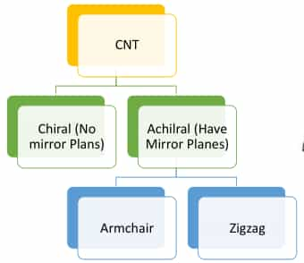
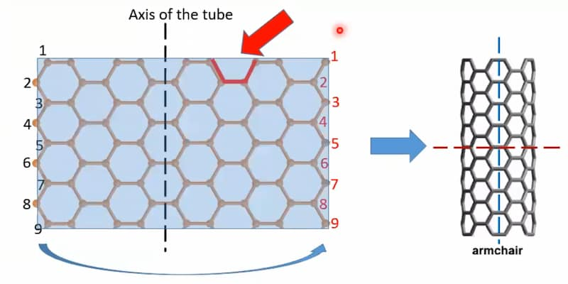
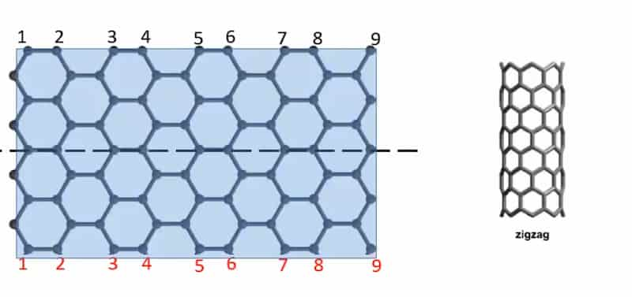
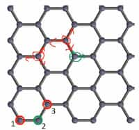

A rolled up sheet of graphene.

## Classifications

### Based on structure

1. Single wall carbon nanotubes (SWNT)
2. Multi-walled carbon nanotubes (MWNT)  
   Similar to graphite but rolled up as a set of sheets.

### Based on Chirality

Chirality means the way that graphene sheet is oriented with respect to the axis
of carbon nanotube.



### Achiral

Have mirror planes. Has 2 types.

1. Armchair
2. Zigzag

#### Armchair



Circumference has a repeating armchair structure.

#### Zigzag



Circumference has a repeating zigzag structure.

### Chiral

No mirror planes. Definition for the chiral type is later explained.

## Definitions

### Equivalent Atoms

Equivalent atoms means the atoms having the same surrounding.



In graphene, next-near neighbours are equivalent atoms.

When a graphene sheet is rolled to create a CNT, only equivalent atoms can be
connected.

### Primitive Vectors

Vectors used to describe a unit cell.

For graphene, any 2 adjacent sides of the unit cell can be used as the primitive
vectors.

### Lattice Vectors

Any vector connecting 2 equivalent atoms. A lattice vector can be expressed in
terms of primitive vectors.

### Chiral Vector

The vector that constructs the circumference of a CNT. Also called as
Circumferential vector.

### (n,m) notation

If the chiral vector can be expressed as $na_1 + ma_2$ where $a_1,a_2$ are the
primitive vectors, then the notation for the nanotube is $(n,m)$

- $n=0 \lor m =0$: zigzag tube
- $n=m$: armchair tube
- Otherwise: chiral tube

### Chiral Angle

Angle between the chiral vector and nearest zigzag angle.

For a $(n,m)$ tube where $n>0$ and $n\ge m\ge 0$:

```math
\theta=\tan^{-1}\bigg( \frac{\sqrt{3}m}{2n+m}\bigg)
```

- $\theta=30°$: armchair tube
- $\theta=0°$: zigzag tube
- $0°<\theta<30°$: chiral tube

### Chiral Vector Length

For a $(n,m)$ tube, the chiral vector's length is given by: $ $

```math
|\text{CH}|=a\sqrt{n^2+m^2+nm}
```

Here $a$ is the bond length of C-C. $ $

### Diameter of CNT

The diameter can be expressed by:

```math
D=\frac{|\text{CH}|}{\pi}=\frac{a}{\pi}\sqrt{n^2+m^2+nm}
```

## Properties

- Mechanical properties
  - High young's modulus  
    Depends on tube diameter, multi-walled or single-walled but not tube
    chirality. Multi-walled CNTs have higher young's modulus.
  - Sustains higher strain
- Electrical properties
  - Depends on chirality and size
  - Exhibits superconductivity at $20\text{K}$
  - Band structure changes with chirality
- Thermal properties
  - Conducts thermal energy only in the axial direction; radial direction is
    insulating

### Chirality-dependent

For a $(n,m)$ tube: $ $

- If $n=m$, its armchair typed and is metallic (good conductors)
- If $n-m$ is a integer multiple of $3$: small band gap semiconductors
- Else: large band gap semiconductors

Band gap decreases as the radius increases.

## Applications

- Conductive or reinforced plastic
- CNT based transistors
- Molecular electronics
- Energy storage devices
- Biomedical applications
